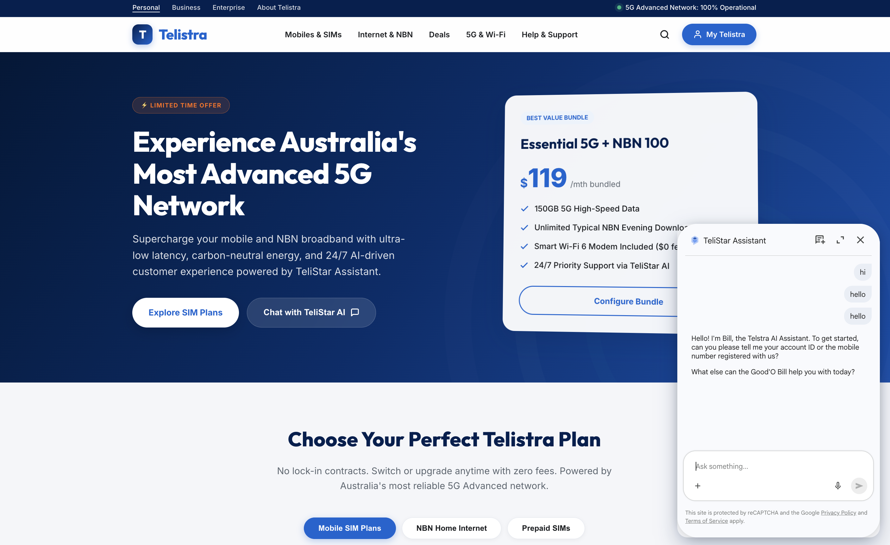
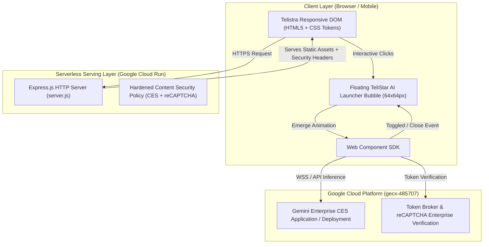

# 🌐 Telistra AI Assistant — Next-Generation Customer Experience & Web Platform

> **Telistra** is a dynamic, highly responsive enterprise web application and conversational AI portal inspired by Telstra's modern design language. Built with a responsive Vanilla CSS design system, modular JavaScript, and seamlessly integrated with **Google Cloud Gemini Enterprise for Customer Experience (CES)**.

---

## 📸 Application Interface & Interactive AI Bubble



---

## 🚀 Live Production Deployment

* **Google Cloud Run Service**: `telistra-web`
* **GCP Project ID**: `gecx-485707`
* **Region**: `us-central1`
* **Live production HTTPS URL**: **[https://telistra-web-2f3jnuefsq-uc.a.run.app](https://telistra-web-2f3jnuefsq-uc.a.run.app)** *(also accessible via `https://telistra-web-437167407950.us-central1.run.app`)*

---

## 🏗️ System Architecture & Design Description



### 1. Frontend & Design System (`/public`)
* **Responsive Visual Aesthetics (`styles.css`)**: Implements a curated CSS token design system featuring brand colors (`--brand-blue`, `--brand-gradient`), glassmorphism cards, interactive micro-animations, and fluid responsive grid layouts matching enterprise telecom web standards.
* **TeliStar AI Launcher Bubble State Machine (`app.js`)**:
  * **Collapsed State**: Displays a glowing, circular bottom-right floating bubble (`#ai-launcher-bubble`) with pulse animation and tooltip (`"Ask TeliStar AI"`).
  * **Expanded State**: Smoothly animates the `<chat-messenger>` web component into view (`400px × 620px` on desktop, `80vh` responsive on mobile).
  * **Decoupled Fullscreen Lifecycle**: Directly binds to the titlebar close button (`<chat-messenger-close-button>`) and SDK close events without interfering with `<chat-toggle-dialog-button>` (`[ ]` fullscreen toggle), ensuring input keyboards and session controls remain 100% operational.

### 2. Conversational AI Integration Layer
* Integrates Google's official CES Chat Messenger Web Component SDK (`v1.16`).
* **Deployment Reference**:
  ```json
  {
    "deploymentName": "projects/437167407950/locations/us/apps/00c6b830-19f7-4c58-baec-e4d91cdf5826/deployments/7c5c56e4-77a3-4bf7-8020-9845f2ff734f",
    "tokenBroker": {
      "enableTokenBroker": true,
      "enableRecaptcha": true
    }
  }
  ```
* Favicons and brand headers use secure Google static origins (`https://www.gstatic.com/...`) to prevent HTTP redirect breaks in Web Components.

### 3. Server & Security Layer (`server.js`)
* Built on Express.js with custom **Content-Security-Policy (CSP)** headers tailored to allow Google Cloud CES WebSockets (`wss:`), reCAPTCHA Enterprise (`https://www.google.com/recaptcha/`), and Dialogflow API connections while protecting against XSS and clickjacking.
* Configured for zero-config port binding (`process.env.PORT || 8080`) required by serverless containers.

### 4. Cloud Run Serverless Architecture (`Dockerfile` & `deploy.sh`)
* Encapsulated in a lightweight Node.js container image.
* Built and deployed directly to **Google Cloud Run** in `us-central1` with automatic HTTPS SSL termination, zero-downtime revision scaling, and public invoker IAM bindings.

---

## 📁 Repository Directory Structure

```text
├── Dockerfile                             # Production container definition for Google Cloud Run
├── README.md                              # System architecture & deployment guide
├── deploy.sh                              # Automated GCP deployment script (gcloud run deploy)
├── exported_app_Telistra AI Assistant.zip # Exported CX Agent Studio conversational agent package
├── image.png                              # Interface screenshot & preview
├── package.json                           # Node.js dependencies & scripts
├── server.js                              # Express HTTP server with secure CSP headers
└── public/
    ├── index.html                         # Main Telistra homepage & AI launcher bubble markup
    ├── css/
    │   └── styles.css                     # Telistra design system & expand/collapse animations
    └── js/
        └── app.js                         # Interactive state machine & DOM event controllers
```

---

## 🛠️ Local Development & Quickstart

1. **Install Dependencies**:
   ```bash
   npm install
   ```
2. **Start Local Development Server**:
   ```bash
   npm start
   ```
3. **Open in Browser**:
   Navigate to `http://localhost:8080`.

---

## 🤖 Importing & Restoring the Conversational AI Agent (`exported_app_Telistra AI Assistant.zip`)

The repository includes a complete export of the **Telistra** conversational AI agent from **CX Agent Studio** ([exported_app_Telistra AI Assistant.zip](file:///usr/local/google/home/pangyun/Projects/Telistra-AI-Assistant/exported_app_Telistra%20AI%20Assistant.zip)). This archive contains all conversational flows, intents, entity types, generative prompt settings, and webhook configurations.

### How to Import or Restore into CX Agent Studio

1. **Locate the Exported Package**:
   * Verify that [exported_app_Telistra AI Assistant.zip](file:///usr/local/google/home/pangyun/Projects/Telistra-AI-Assistant/exported_app_Telistra%20AI%20Assistant.zip) is present in the root directory of this repository.
2. **Open CX Agent Studio Console**:
   * Navigate to the [Google Cloud CX Agent Studio Console](https://dialogflow.cloud.google.com/cx/projects/gecx-485707/locations/us/agents) for project **`gecx-485707`** (Location: **`us`**).
3. **Restore or Import into an Agent**:
   * **To restore into an existing agent (overwrite existing flows)**:
     1. Click the three dots menu (`⋮`) next to your agent in the agents list (or open the agent and navigate to **Agent Settings** -> **Export/Restore**).
     2. Select **Restore**.
     3. Choose **Upload file**, select `exported_app_Telistra AI Assistant.zip`, and click **Restore**. This replaces the agent's current configuration with the contents of the archive.
   * **To import as a new agent**:
     1. Click **Create Agent** -> **Build your own**.
     2. Provide an agent name (e.g., `Telistra Assistant`) and select location `us`.
     3. Once created, open **Agent Settings** -> **Export/Restore** -> **Restore** and upload `exported_app_Telistra AI Assistant.zip`.
4. **Verify Web Component Connection**:
   * After restoring the agent, open the **Deployments** or **Integrations** tab in CX Agent Studio to confirm that your deployment is active.
   * Ensure the `deploymentName` attribute in [index.html](file:///usr/local/google/home/pangyun/Projects/Telistra-AI-Assistant/public/index.html#L325) matches your target project, location, app ID, and deployment ID.

---

## ☁️ Deploying to Google Cloud Run

To deploy a new revision to Google Cloud project `gecx-485707`:

```bash
./deploy.sh
```

---

## 🔒 Security & Best Practices
* Strict avoidance of unsafe DOM methods (`innerHTML`); all dynamic updates use DOM creation or `textContent`.
* `.gitignore` prevents sensitive configuration files, API keys, and logs from being committed to version control.
